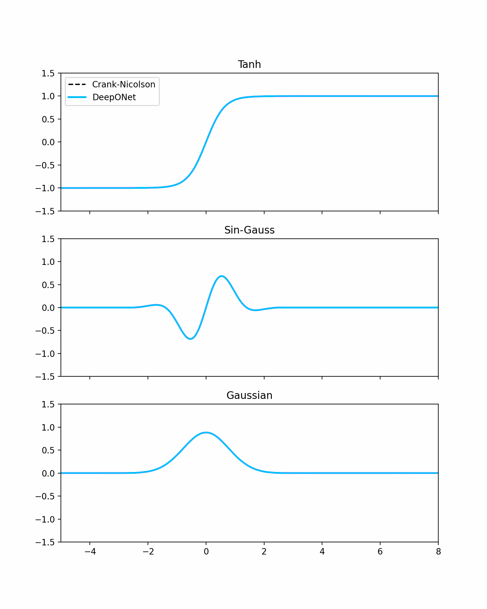

## Physics-Informed DeepONet for the Advection-Diffusion-Reaction (ADR) Equation
This repository contains the implementation of a PI-DeepONet (Physics-Informed Deep Operator Network) dedicated to solving and learning operators for the Advection-Diffusion-Reaction equation. The model is designed to generalize the dynamics from various initial conditions (Gaussian, Tanh, and Sin Gauss) over a reduced spatial domain.
### Problem Physics
The modeled ADR equation is as follows: $$u_t + v u_x = D u_{xx} + \mu u (1 - u)$$
Where:
- Advection ($v$): Signal transport.
- Diffusion ($D$): Spreads the profile over time.
- Reaction ($\mu$): Logistic reaction term (signal growth).
### Model Architecture
The network is based on the original DeepONet architecture, augmented by physical constraints (Pinn-based):
- Branch Net: Takes the initial condition parameters as input (dimension 9).
- Trunk Net: Takes the $(x, t)$ coordinates as input with Fourier Features to capture steep gradients.
- Activation: SiLU (Swish).
- Latent Dimension : 256.
### Training Strategy
To guarantee long-term accuracy ($t_{max} = 3.0$) and avoid catastrophic forgetting, the model uses:
1. Time Marching: Progressive training through successive time windows.
2. Unsupervised Training: The physical equation is the sole driver of the physics.
3. Warm-up: Strict adherence to the initial condition using a dedicated loop.
4. Adam + L-BFGS strategy for improved accuracy.
5. Adaptive Sampling: Targeted retraining of dropout zones using a data mix.
6. NTK Adaptive Weights
7. King of the Hill and Rollback : Allows you to save and restore the best weights.
8. Additing via a classical solver to verify the validity of the training. However, the classical solver does not participate in the training process itself; it is used solely for monitoring.
### Results

*Comparison of the temporal L2 error between DeepONet, Crank-Nicolson, and the analytical solution.*

*Evolution of the DeepONet prediction vs. Ground Truth.*
### Usage
Installation :
   ```bash
   git clone https://github.com/Emma-Grspl/These_DeepONet_ADR.git
   pip install -r requirements.txt
   python scripts/train.py
   python src/analyse/global_analyse_PI_DeepOnet_vs_CN_vs_analytical.py  #comparison between PI_DeepONet, Crank Nicholson solver and analytical result
